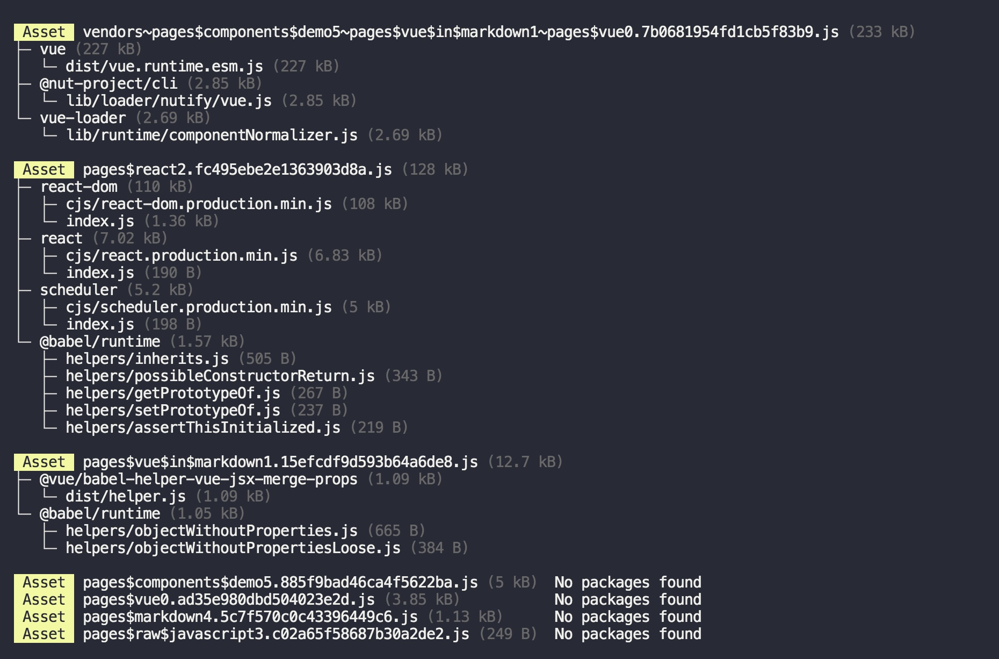

# webpack-stats-tree

[](https://github.com/fengzilong/webpack-stats-tree/actions)

Parse webpack stats to `chunk → modules → file` tree



You can see which modules and files are in your chunk 🎉

## Installation

```bash
npm i webpack-stats-tree
```

## API

```js
const { analyze, format } = require( 'webpack-stats-tree' )

console.log( format( analyze( webpackStats ) ) )
```

## License

MIT
